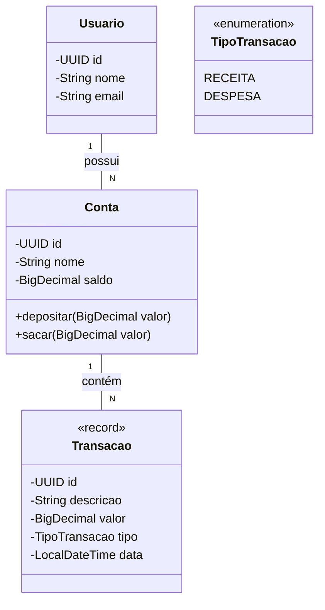

# Sistema de Controle Financeiro Pessoal

**Status do Projeto:** `Em Desenvolvimento` 🚧

## 1. Visão Geral

Este projeto é uma aplicação de console para gerenciamento de finanças pessoais, desenvolvida como parte do meu portfólio de estudos em Java. O objetivo é construir um sistema robusto, bem testado e com código limpo, aplicando os princípios da Programação Orientada a Objetos (POO) e do Desenvolvimento Orientado a Testes (TDD).

## 2. Arquitetura

O projeto segue os princípios da **Arquitetura Hexagonal (Ports and Adapters)**. O objetivo é isolar completamente o núcleo de regras de negócio (`domain`) das tecnologias de entrega (UI, API) e de infraestrutura (banco de dados).

Isso garante que o coração da aplicação seja testável de forma independente e flexível para evoluir, permitindo que a interface de console seja, no futuro, substituída ou acompanhada por uma API REST ou GraphQL sem impacto no domínio.

## 3. Modelo de Domínio

O núcleo do sistema é modelado com foco em encapsulamento e regras de negócio explícitas. As principais entidades são:



## 4. Tecnologias Utilizadas

* **Linguagem:** Java 21
* **Gerenciador de Build:** Apache Maven
* **Testes:** JUnit 5

## 5. Principais Features (Planejadas)

* [ ] Cadastro de Usuários e Contas.
* [ ] Registro de Transações (Receitas e Despesas).
* [ ] Categorização de Transações.
* [ ] Transferência de valores entre contas.
* [ ] Geração de relatórios mensais simples.

## 6. Como Executar o Projeto

**Pré-requisitos:**
* Java (JDK) 21 ou superior.
* Apache Maven 3.8 ou superior.

1.  **Clone o repositório:**
    ```sh
    git clone [https://github.com/](https://github.com/)[seu-usuario-github]/[nome-do-repositorio].git
    ```
2.  **Navegue até a pasta do projeto:**
    ```sh
    cd [nome-do-repositorio]
    ```
3.  **Compile e empacote o projeto:**
    ```sh
    mvn clean package
    ```
4.  **Execute a aplicação:**
    ```sh
    java -cp target/[nome-do-repositorio]-1.0-SNAPSHOT.jar br.com.mateussilva.financeiro.application.Main
    ```

## 7. Como Rodar os Testes

Para garantir a qualidade e a integridade do código, execute a suíte de testes unitários com o seguinte comando na raiz do projeto:
```sh
mvn test
```